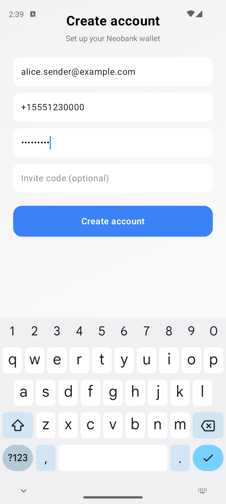
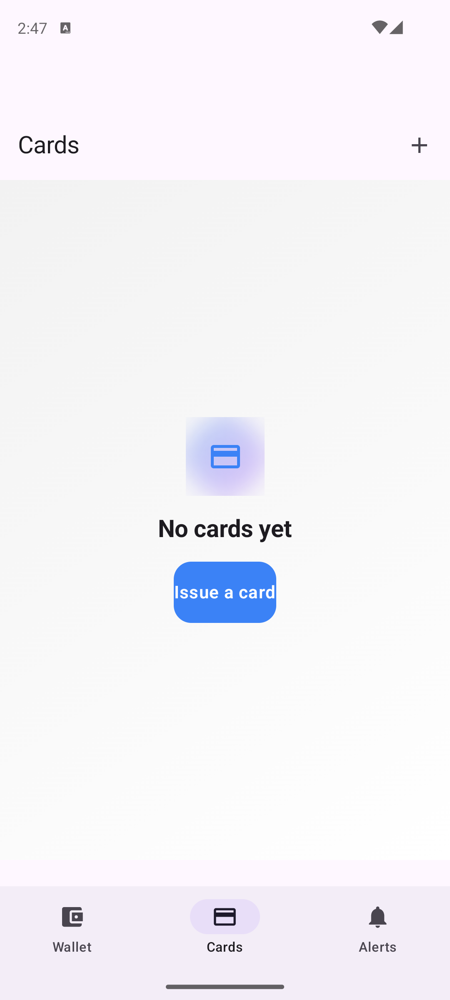
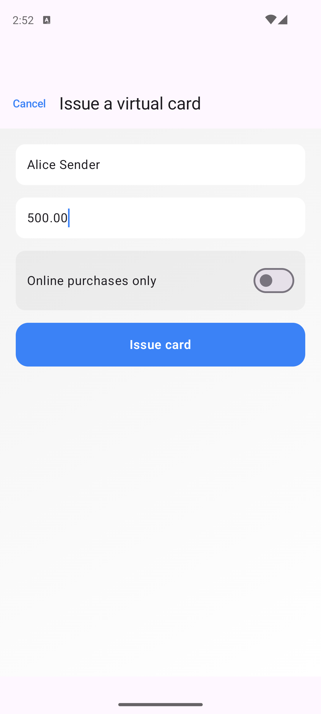
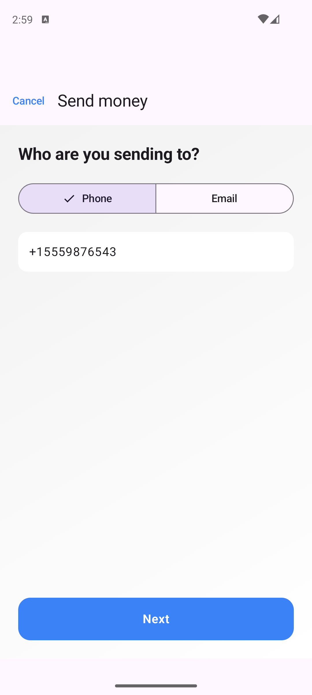
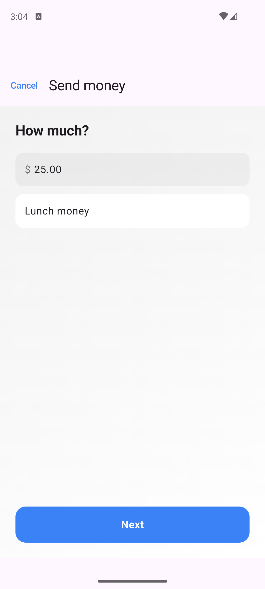
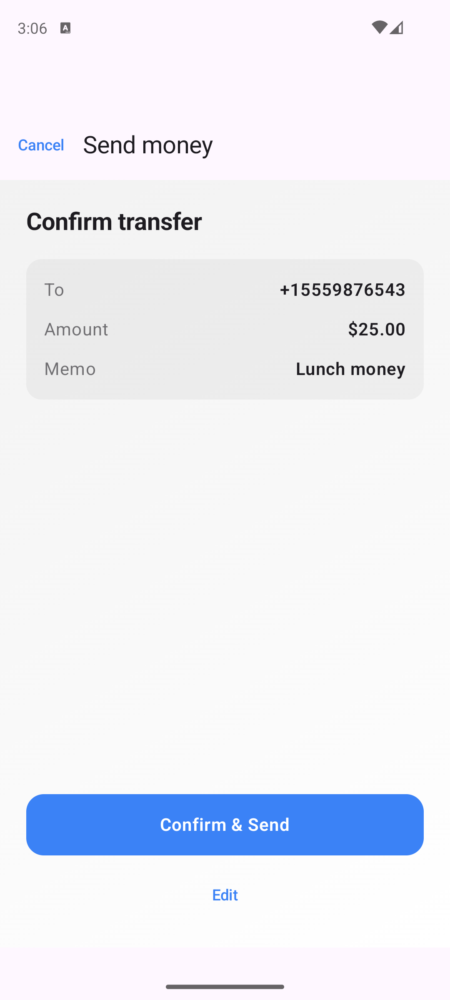
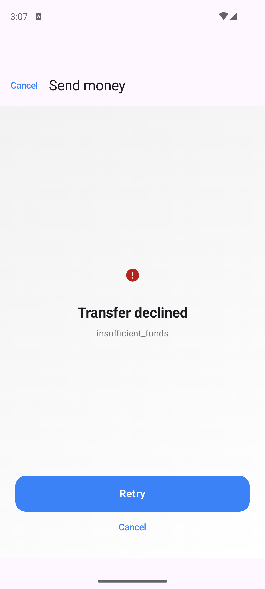

# NeobankNative (Android)

A native Jetpack Compose client for the [neobank](../README.md) gateway BFF — built
feature-for-feature alongside [`../ios-native`](../ios-native) (SwiftUI) and the existing
Flutter app ([`../mobile`](../mobile)) against the same API, as a comparison point for
what all three toolkits look like on the same backend.

## Screenshots

<table>
  <tr>
    <td align="center"><br><sub>Login</sub></td>
    <td align="center"><br><sub>Register</sub></td>
    <td align="center"><br><sub>KYC gate</sub></td>
    <td align="center"><br><sub>Wallet</sub></td>
  </tr>
  <tr>
    <td align="center"><br><sub>Cards (empty)</sub></td>
    <td align="center"><br><sub>Issue card</sub></td>
    <td align="center"><br><sub>Cards</sub></td>
    <td align="center"><br><sub>Card detail</sub></td>
  </tr>
  <tr>
    <td align="center"><br><sub>Card frozen</sub></td>
    <td align="center"><br><sub>Send: recipient</sub></td>
    <td align="center"><br><sub>Send: amount</sub></td>
    <td align="center"><br><sub>Send: confirm</sub></td>
  </tr>
  <tr>
    <td align="center"><br><sub>Send: result</sub></td>
    <td align="center"><br><sub>Alerts</sub></td>
    <td></td>
    <td></td>
  </tr>
</table>

All captured on a Pixel 8 emulator (API 36) running end-to-end against a live local
gateway stack (`make up-all-ledger`) — real register → KYC → card issue/freeze →
declined P2P transfer → notification flow, not mocked data.

## Requirements

- Android Studio (Ladybug+) or the command-line tools, JDK 17, Android SDK with
  `compileSdk 36` / `build-tools 36.0.0`
- The gateway running locally at `http://10.0.2.2:8080` — that's the Android emulator's
  alias for the host machine's `localhost`, matching the gateway from the
  [root README](../README.md#quick-start); override with the `API_BASE_URL` environment
  variable before building if it's running elsewhere (e.g. a physical device on the same
  network)

```sh
./gradlew :app:installDebug   # build + install on a running emulator/device
```

or open the project root in Android Studio and run the `app` configuration.

## Architecture decisions

- **State management: `StateFlow`-backed controllers, not `ViewModel` + Hilt.** Every
  feature controller (`AuthController`, `WalletController`, `CardsController`, ...) is a
  plain class exposing a `StateFlow`, instantiated once in `AppEnvironment` and handed
  down through `CompositionLocal`s (`LocalAuthController`, `LocalWalletController`, ...)
  — Compose's answer to SwiftUI's `.environment(_:)` / `@Environment(Type.self)`. No
  `ViewModelProvider.Factory` boilerplate, no DI framework: `AppEnvironment` *is* the
  composition root, built once in `NeobankApplication` and threaded through
  `CompositionLocalProvider` at the top of `NeobankApp`.
- **Concurrency: structured coroutines, not RxJava/LiveData.** The notification poll
  loop is a `while (isActive) { delay(30_000); refresh() }` inside a `LaunchedEffect`
  keyed on the session generation — it cancels automatically when the tab leaves
  composition or the session changes, no manual `Timer`/`cancel()` bookkeeping. A 401
  mid-request triggers a token refresh through a `Mutex`-coordinated `RefreshCoordinator`
  that coalesces concurrent refresh attempts into one in-flight `Deferred`, so N requests
  failing at once don't each kick off their own refresh (mirrors ios-native's `actor
  RefreshCoordinator` exactly).
- **Networking: one hand-rolled `ApiClient`, no Retrofit.** `core/networking/` is a small
  OkHttp-based client (~180 lines) with two instances wired up in `AppEnvironment`: an
  unauthenticated one for `/v1/auth/login` and `/v1/auth/register`, and an authenticated
  one that attaches the bearer token and transparently refreshes it on 401. JSON goes
  through `kotlinx.serialization` with `JsonNamingStrategy.SnakeCase`, matching the
  gateway's field naming directly instead of a `@SerialName` per field.
- **Session-scoped cache invalidation via a generation token, not an explicit
  invalidate-list.** `SessionStore` exposes a `generation: StateFlow<UUID>` bumped on
  every transition; feature screens key their `LaunchedEffect(sessionStore.generation)`
  reload off that. A controller doesn't need to know it must be reset — it just always
  reloads fresh data when the session changes, including a logout-then-login-as-someone-
  else cycle.
- **Token storage: `EncryptedSharedPreferences`** (Android Keystore-backed AES-256),
  the platform equivalent of ios-native's Keychain-backed `TokenStorage`.
- **Design system:** `core/design/Theme.kt` — a brand gradient (blue → purple), a
  navy/near-black gradient background in dark mode vs. soft gray-to-white in light,
  glassy low-opacity-fill cards, capsule status pills, and a `PrimaryButton`/`GlowIcon`/
  `StatusPill`/`BrandTextField` set of small reusable composables, applied consistently
  across every screen — a direct port of ios-native's `Theme.swift`. A system/light/dark
  appearance override (`AppAppearance`, `SharedPreferences`-backed, Compose's
  `@AppStorage` equivalent) is exposed from the Wallet tab's toolbar.
- **Navigation: one `NavHost` for auth (login ⇄ register), one for the main tabs.**
  `MainTabsScreen` hosts a bottom `NavigationBar` (Wallet / Cards / Alerts) plus
  full-screen pushed routes for card detail, issue-card, and send-money — the Android
  equivalent of ios-native's `.sheet(isPresented:)` modals, since Compose has no direct
  analogue to a SwiftUI sheet that also participates in the system back button. Each tab
  renders its own `Scaffold`/top bar, mirroring ios-native's `TabView` of independent
  `NavigationStack`s.
- **Folder structure: feature-first**, matching both other clients' layout:

  ```
  app/src/main/kotlin/dev/horobets/neobanknative/
    core/              # config, networking (ApiClient, ApiError), storage (EncryptedSharedPreferences),
                        # design system, formatting, session/auth plumbing
    features/
      auth/            # login, register
      kyc/             # KYC gate: form, pending, rejection
      wallet/          # balance, paginated transaction history
      cards/           # list, issue, detail (freeze/unfreeze)
      transfers/       # send-money flow (recipient -> amount -> confirm/result)
      notifications/   # alerts list, mark read / mark all read, background polling
    root/              # session gate -> KYC gate -> tab shell
  ```

## What's implemented

Auth (login/register, Keystore-backed session, automatic token refresh) → KYC gate →
tabbed Wallet / Cards / Alerts shell, plus a full send-money flow off the Wallet tab.
Feature-for-feature parity with ios-native, including the same deliberate gaps: **card
authorizations (list/detail)** and **transfer history** are left out, since the Wallet
transaction feed and Alerts already surface the same underlying events (transfers,
freezes, deposits).

## A deliberate quirk worth knowing about

`POST /v1/transfers` requires a stable `Idempotency-Key` across retries after a network
error, but a fresh one once a submission reaches a definitive server outcome — otherwise
a second "Send" tap after a successful transfer would be replayed as a duplicate of the
first. `TransferSubmitController` only rotates the key after landing in a `Result`
state, not after `Failed`, mirroring ios-native's `TransferSubmitController` (and the
Flutter app's) exactly.
