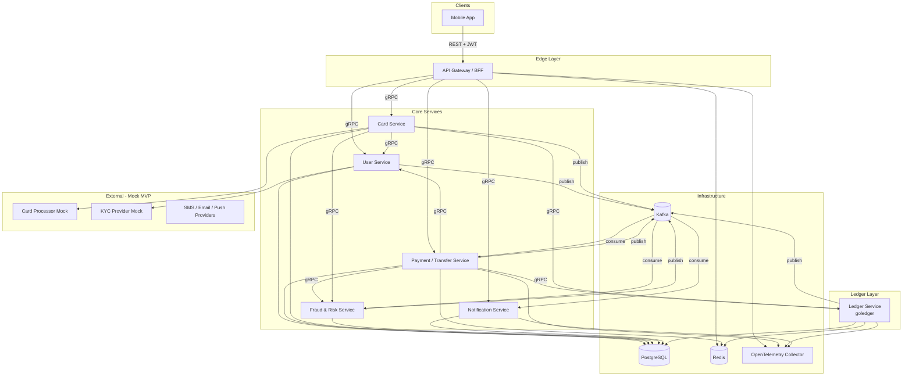
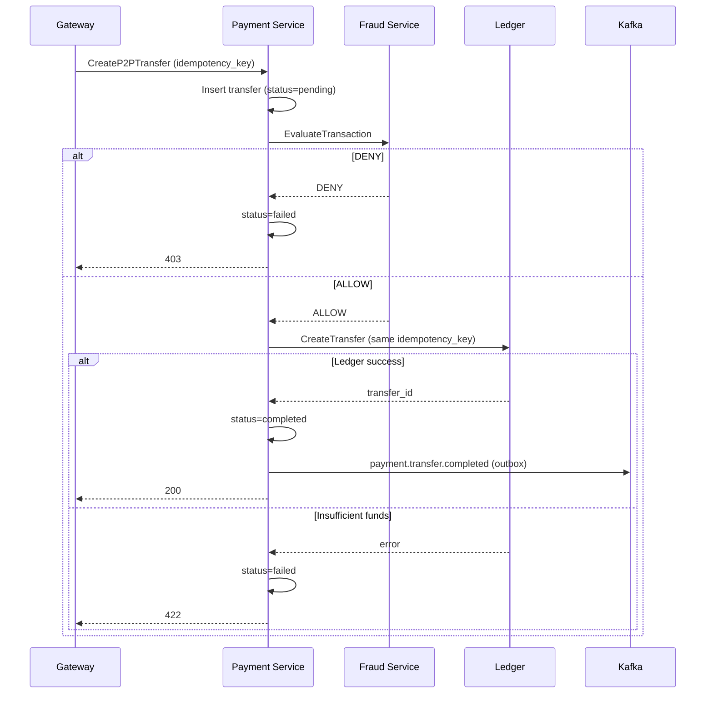
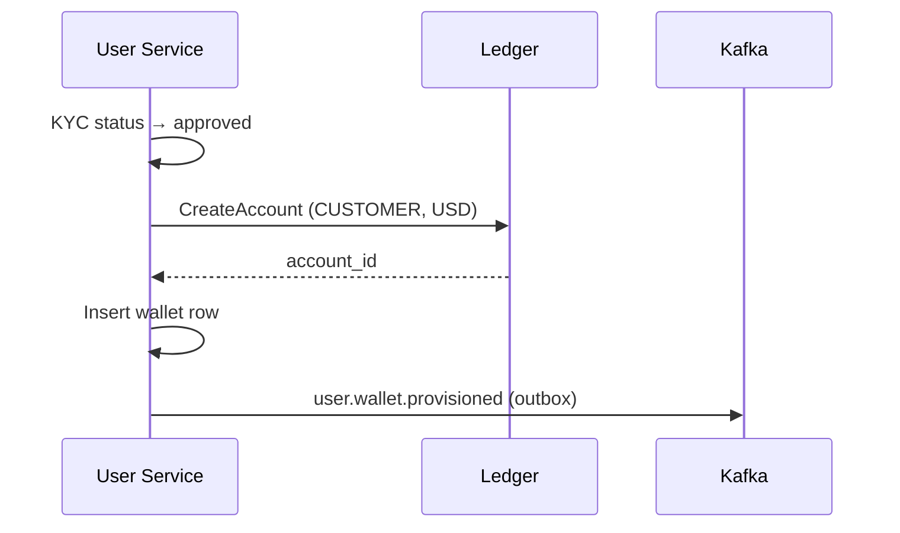
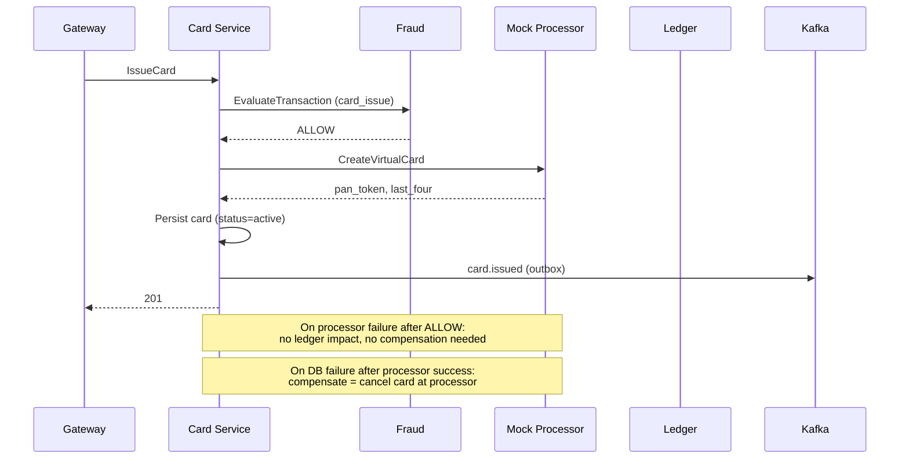

# Neobank Backend — System Architecture & Design

> Production-oriented backend for a mobile-first neobank, built around the existing [goledger](https://github.com/iho/goledger) double-entry ledger service.

---

## 1. High-Level Architecture

### System Diagram



### Service Boundaries & Communication

| From | To | Protocol | Purpose |
|------|-----|----------|---------|
| Mobile | Gateway | REST/HTTPS | Single public API, mobile-optimized DTOs |
| Gateway | All services | gRPC (mTLS internal) | Orchestration, auth propagation |
| Payment, Card | Ledger | gRPC | All monetary mutations |
| Payment, Card | Fraud | gRPC sync | Pre-authorization risk check |
| All writers | Kafka | Outbox → Kafka | Domain events, async workflows |
| Notification | Kafka | Consumer | Push/email/SMS triggers |
| Fraud | Kafka | Consumer | Post-transaction monitoring, velocity rules |

**Key principle:** Only the **Ledger Service** mutates balances. Every other service owns its domain state and references ledger accounts by ID.

### Monorepo Layout

```
neobank/
├── api/                          # OpenAPI specs (BFF public API)
├── proto/
│   ├── buf.yaml
│   ├── neobank/v1/               # Cross-service contracts
│   └── goledger/v1/              # Vendored from goledger (buf dep)
├── pkg/
│   ├── idempotency/              # Shared idempotency middleware
│   ├── outbox/                   # Outbox publisher library
│   ├── saga/                     # Saga orchestrator framework
│   ├── events/                   # Event envelope + serde
│   ├── money/                    # Decimal helpers (shopspring/decimal)
│   ├── otel/                     # Tracing bootstrap
│   └── grpcutil/                 # Interceptors (auth, idempotency, retry)
├── services/
│   ├── ledger/                   # goledger (git submodule or go.mod replace)
│   ├── gateway/
│   ├── user/
│   ├── payment/
│   ├── card/
│   ├── fraud/
│   └── notification/
├── deployments/
│   ├── docker-compose.yml
│   ├── docker-compose.full.yml
│   └── k8s/
├── go.work
└── Makefile
```

---

## 2. MVP Scope & Phased Plan

### Phase 1 — MVP (8–12 weeks, small team)

| # | Capability | User-visible outcome |
|---|------------|---------------------|
| 1 | User registration + login | Sign up with email/phone, JWT auth |
| 2 | Wallet provisioning | Auto-create USD ledger account on KYC-lite pass |
| 3 | View balance & history | Balance, transaction list (CQRS read model) |
| 4 | P2P transfer | Send money to another user by phone/email |
| 5 | Virtual card | Issue, freeze, view masked PAN |
| 6 | Card authorization (mock) | Hold → capture flow against ledger |
| 7 | Basic fraud rules | Velocity limits, amount caps, block list |
| 8 | Notifications | Push/email on transfer & card events |

### Recommended Implementation Order

```
Week 1-2:  Monorepo scaffold, docker-compose, shared pkg (otel, idempotency, outbox)
Week 2-3:  Ledger integration (goledger as submodule, gRPC client lib)
Week 3-4:  User Service + Gateway auth
Week 4-5:  Payment Service (P2P) + Fraud sync check
Week 5-6:  Event bus + Notification Service
Week 6-7:  Card Service + mock processor
Week 7-8:  Saga hardening, integration tests, observability dashboards
```

**Rationale:** Ledger and User are foundations. Payment is the first money-moving flow and validates the Ledger integration. Events + Notifications come before Card so card issuance can reuse the pipeline. Fraud is inlined early (sync) and deepened async later.

### Defer to Later Phases

| Phase 2 | Phase 3+ |
|---------|----------|
| Full KYC (document upload, vendor integration) | Multi-currency FX |
| External bank transfers (ACH/SEPA) | ML fraud models |
| Physical cards | Regulatory reporting (SAR, CTR) |
| Disputes & chargebacks | Data warehouse / analytics lake |
| Admin portal | Open Banking / PSD2 |
| Strong Customer Authentication (3DS) | Interest, savings pots |
| Reconciliation jobs | Credit/lending |

---

## 3. Integration Strategy with goledger

### How to Integrate

1. **Submodule or `go.mod replace`** — Keep goledger as an independent repo; reference it from `services/ledger/`:

   ```go
   // go.work
   use (
       ./services/ledger
       ./services/payment
       ...
   )

   // services/payment/go.mod
   require github.com/iho/goledger v0.x.x
   ```

2. **Proto sharing** — Import goledger protos via buf:

   ```yaml
   # proto/buf.yaml
   deps:
     - buf.build/iho/goledger  # or local path
   ```

3. **Service-to-service only** — Mobile app never calls Ledger directly. Payment/Card services are the only gRPC clients.

4. **Account mapping** — User Service stores `ledger_account_id` per wallet; Payment stores transfer metadata referencing `ledger_transfer_id`.

### Recommended Extensions to goledger

| Extension | Priority | Description |
|-----------|----------|-------------|
| `external_id` on Account | P0 | Map `user_id` / `wallet_id` → ledger account without name-hacking |
| `account_type` enum | P0 | `CUSTOMER`, `SUSPENSE`, `SETTLEMENT`, `FEE` — controls balance rules |
| Outbox table + publisher | P0 | Emit `ledger.transfer.created` reliably |
| Response caching in idempotency | P1 | Return cached gRPC response on duplicate key (currently returns `AlreadyExists`) |
| OpenTelemetry tracing | P1 | Add otelgrpc alongside existing Prometheus |
| `GetBalance` snapshot API | P1 | Fast balance read without full account fetch |
| Partitioning on `entries` | P2 | By `created_at` monthly when volume grows |

### Ledger Account Topology (MVP)

```
Per customer:
  CUSTOMER:{user_id}:USD     — spendable wallet (allow_positive only)

System accounts:
  SUSPENSE:OUTBOUND:USD      — outgoing payments in flight
  SUSPENSE:INBOUND:USD       — incoming payments in flight
  SETTLEMENT:CARD:USD        — card network settlement
  FEE:PLATFORM:USD           — platform fee income
```

---

## 4. Detailed Service Design

### 4.1 User Service

**Responsibilities:** Identity, profile, device tokens, KYC-lite state machine, wallet provisioning trigger.

**Key APIs (gRPC):**

```protobuf
// proto/neobank/v1/user_service.proto
syntax = "proto3";
package neobank.v1;

service UserService {
  rpc Register(RegisterRequest) returns (RegisterResponse);
  rpc Login(LoginRequest) returns (LoginResponse);
  rpc GetProfile(GetProfileRequest) returns (GetProfileResponse);
  rpc UpdateProfile(UpdateProfileRequest) returns (UpdateProfileResponse);
  rpc SubmitKYC(SubmitKYCRequest) returns (SubmitKYCResponse);
  rpc GetKYCStatus(GetKYCStatusRequest) returns (GetKYCStatusResponse);
  rpc RegisterDevice(RegisterDeviceRequest) returns (RegisterDeviceResponse);
}

message RegisterRequest {
  string email = 1;
  string phone = 2;
  string password = 3;
  string idempotency_key = 4;
}

message RegisterResponse {
  string user_id = 1;
  string access_token = 2;
  string refresh_token = 3;
}

message SubmitKYCRequest {
  string user_id = 1;
  string full_name = 2;
  string date_of_birth = 3;  // YYYY-MM-DD
  string country_code = 4;   // ISO 3166-1 alpha-2
  string idempotency_key = 5;
}

enum KYCStatus {
  KYC_STATUS_UNSPECIFIED = 0;
  KYC_STATUS_PENDING = 1;
  KYC_STATUS_APPROVED = 2;
  KYC_STATUS_REJECTED = 3;
  KYC_STATUS_MANUAL_REVIEW = 4;
}
```

**Data model:**

```sql
CREATE TABLE users (
    id            UUID PRIMARY KEY DEFAULT gen_random_uuid(),
    email         TEXT UNIQUE NOT NULL,
    phone         TEXT UNIQUE,
    password_hash TEXT NOT NULL,
    status        TEXT NOT NULL DEFAULT 'active',  -- active, suspended, closed
    created_at    TIMESTAMPTZ NOT NULL DEFAULT now(),
    updated_at    TIMESTAMPTZ NOT NULL DEFAULT now()
);

CREATE TABLE profiles (
    user_id       UUID PRIMARY KEY REFERENCES users(id),
    full_name     TEXT,
    date_of_birth DATE,
    country_code  CHAR(2),
    avatar_url    TEXT
);

CREATE TABLE kyc_cases (
    id            UUID PRIMARY KEY DEFAULT gen_random_uuid(),
    user_id       UUID NOT NULL REFERENCES users(id),
    status        TEXT NOT NULL DEFAULT 'pending',
    submitted_at  TIMESTAMPTZ,
    decided_at    TIMESTAMPTZ,
    rejection_reason TEXT
);

CREATE TABLE wallets (
    id                  UUID PRIMARY KEY DEFAULT gen_random_uuid(),
    user_id             UUID NOT NULL REFERENCES users(id),
    currency            CHAR(3) NOT NULL DEFAULT 'USD',
    ledger_account_id   TEXT NOT NULL UNIQUE,  -- goledger account ID
    status              TEXT NOT NULL DEFAULT 'active',
    created_at          TIMESTAMPTZ NOT NULL DEFAULT now(),
    UNIQUE (user_id, currency)
);

CREATE TABLE device_tokens (
    id          UUID PRIMARY KEY DEFAULT gen_random_uuid(),
    user_id     UUID NOT NULL REFERENCES users(id),
    platform    TEXT NOT NULL,  -- ios, android
    token       TEXT NOT NULL,
    created_at  TIMESTAMPTZ NOT NULL DEFAULT now(),
    UNIQUE (user_id, token)
);
```

**Business rules:**
- On `KYC_APPROVED`, saga provisions ledger account + wallet row (see §5.2).
- Email/phone uniqueness enforced at DB level.
- Password: bcrypt cost 12+, minimum complexity policy.
- User `suspended` → Gateway rejects all mutating calls.

---

### 4.2 Ledger Service (goledger)

**Responsibilities:** Double-entry accounting, holds, transfers, balance integrity. No business logic about users or cards.

**Existing gRPC** (already implemented):

- `AccountService`: CreateAccount, GetAccount, ListAccounts
- `TransferService`: CreateTransfer, CreateBatchTransfer, ReverseTransfer
- `HoldService`: HoldFunds, CaptureHold, VoidHold

**Consumers:** Payment Service, Card Service. Optionally User Service (wallet provisioning saga step).

---

### 4.3 Payment / Transfer Service

**Responsibilities:** P2P transfers, transfer lifecycle, idempotency orchestration, fraud pre-check, ledger execution, read-model projection.

**Key APIs:**

```protobuf
// proto/neobank/v1/payment_service.proto
syntax = "proto3";
package neobank.v1;

service PaymentService {
  rpc CreateP2PTransfer(CreateP2PTransferRequest) returns (CreateP2PTransferResponse);
  rpc GetTransfer(GetTransferRequest) returns (GetTransferResponse);
  rpc ListTransfers(ListTransfersRequest) returns (ListTransfersResponse);
}

message CreateP2PTransferRequest {
  string sender_user_id = 1;
  string recipient_phone = 2;   // or recipient_user_id
  string amount = 3;            // decimal string
  string currency = 4;
  string memo = 5;
  string idempotency_key = 6;
}

message TransferView {
  string id = 1;
  string status = 2;  // pending, completed, failed, reversed
  string sender_user_id = 3;
  string recipient_user_id = 4;
  string amount = 5;
  string currency = 6;
  string ledger_transfer_id = 7;
  string failure_reason = 8;
}
```

**Data model:**

```sql
CREATE TABLE transfers (
    id                  UUID PRIMARY KEY DEFAULT gen_random_uuid(),
    idempotency_key     TEXT NOT NULL UNIQUE,
    type                TEXT NOT NULL,  -- p2p, external_out, external_in
    status              TEXT NOT NULL,    -- pending, completed, failed, reversed
    sender_user_id      UUID NOT NULL,
    recipient_user_id   UUID NOT NULL,
    amount              NUMERIC(20,8) NOT NULL CHECK (amount > 0),
    currency            CHAR(3) NOT NULL,
    memo                TEXT,
    ledger_transfer_id  TEXT,
    failure_reason      TEXT,
    created_at          TIMESTAMPTZ NOT NULL DEFAULT now(),
    completed_at        TIMESTAMPTZ
);

CREATE INDEX idx_transfers_sender ON transfers (sender_user_id, created_at DESC);
CREATE INDEX idx_transfers_recipient ON transfers (recipient_user_id, created_at DESC);
```

**Business rules:**
1. Resolve recipient by phone → user_id → wallet → `ledger_account_id`.
2. Sync fraud check **before** ledger call.
3. Call `TransferService.CreateTransfer` with metadata: `{transfer_id, type: "p2p"}`.
4. On ledger success → status `completed`, emit `payment.transfer.completed`.
5. On insufficient funds → status `failed`, no ledger entry (ledger enforces).
6. Idempotency key scoped to `sender_user_id + key`.

---

### 4.4 Card Service

**Responsibilities:** Virtual card lifecycle, authorization hold management, mock processor adapter.

**Key APIs:**

```protobuf
// proto/neobank/v1/card_service.proto
syntax = "proto3";
package neobank.v1;

service CardService {
  rpc IssueCard(IssueCardRequest) returns (IssueCardResponse);
  rpc GetCard(GetCardRequest) returns (GetCardResponse);
  rpc ListCards(ListCardsRequest) returns (ListCardsResponse);
  rpc FreezeCard(FreezeCardRequest) returns (FreezeCardResponse);
  rpc UnfreezeCard(UnfreezeCardRequest) returns (UnfreezeCardResponse);
  // Internal/webhook — mock processor calls this
  rpc AuthorizeTransaction(AuthorizeTransactionRequest) returns (AuthorizeTransactionResponse);
  rpc CaptureTransaction(CaptureTransactionRequest) returns (CaptureTransactionResponse);
}

message IssueCardRequest {
  string user_id = 1;
  string wallet_id = 2;
  string cardholder_name = 3;
  string idempotency_key = 4;
}

message CardView {
  string id = 1;
  string user_id = 2;
  string last_four = 3;
  string status = 4;  -- active, frozen, cancelled
  string expiry_month = 5;
  string expiry_year = 6;
}
```

**Data model:**

```sql
CREATE TABLE cards (
    id              UUID PRIMARY KEY DEFAULT gen_random_uuid(),
    user_id         UUID NOT NULL,
    wallet_id       UUID NOT NULL,
    processor_ref   TEXT,           -- mock processor ID
    pan_token       TEXT NOT NULL,  -- never store raw PAN
    last_four       CHAR(4) NOT NULL,
    expiry_month    SMALLINT NOT NULL,
    expiry_year     SMALLINT NOT NULL,
    status          TEXT NOT NULL DEFAULT 'active',
    idempotency_key TEXT NOT NULL UNIQUE,
    created_at      TIMESTAMPTZ NOT NULL DEFAULT now()
);

CREATE TABLE card_authorizations (
    id              UUID PRIMARY KEY DEFAULT gen_random_uuid(),
    card_id         UUID NOT NULL REFERENCES cards(id),
    merchant_name   TEXT,
    amount          NUMERIC(20,8) NOT NULL,
    currency        CHAR(3) NOT NULL,
    status          TEXT NOT NULL,  -- authorized, captured, voided, declined
    ledger_hold_id  TEXT,
    ledger_transfer_id TEXT,
    created_at      TIMESTAMPTZ NOT NULL DEFAULT now()
);
```

**Business rules:**
- Card issuance saga: fraud check → mock processor → persist card (see §5.2).
- Authorization: `HoldFunds` on customer wallet for auth amount.
- Capture: `CaptureHold` → settlement account.
- Decline: fraud fail or insufficient funds → no hold created.

---

### 4.5 Fraud & Risk Service

**Responsibilities:** Sync pre-auth checks, async post-transaction monitoring, rule engine (MVP), risk scores.

**Key APIs:**

```protobuf
// proto/neobank/v1/fraud_service.proto
syntax = "proto3";
package neobank.v1;

service FraudService {
  rpc EvaluateTransaction(EvaluateTransactionRequest) returns (EvaluateTransactionResponse);
  rpc ReportTransaction(ReportTransactionRequest) returns (ReportTransactionResponse);
  rpc BlockUser(BlockUserRequest) returns (BlockUserResponse);
}

message EvaluateTransactionRequest {
  string user_id = 1;
  string transaction_type = 2;  -- p2p, card_auth, card_issue
  string amount = 3;
  string currency = 4;
  map<string, string> context = 5;
}

message EvaluateTransactionResponse {
  enum Decision {
    DECISION_UNSPECIFIED = 0;
    DECISION_ALLOW = 1;
    DECISION_REVIEW = 2;
    DECISION_DENY = 3;
  }
  Decision decision = 1;
  string reason_code = 2;
  int32 risk_score = 3;  -- 0-100
}
```

**MVP rules (in order):**
1. User on block list → DENY
2. Single txn > $5,000 → REVIEW
3. > 10 txns / hour → DENY
4. > $10,000 cumulative / 24h → REVIEW
5. New account (< 24h) + txn > $500 → REVIEW

---

### 4.6 Notification Service

**Responsibilities:** Consume domain events, deliver push/email/SMS, template rendering, delivery tracking.

**Key APIs:**

```protobuf
service NotificationService {
  rpc SendNotification(SendNotificationRequest) returns (SendNotificationResponse);
  rpc GetNotificationHistory(GetNotificationHistoryRequest) returns (GetNotificationHistoryResponse);
}
```

**Event-driven (primary path):** Consumes `payment.transfer.completed`, `card.issued`, `card.authorization.*`, `user.kyc.approved`.

**Providers (MVP):** Log-based mock + SMTP (Mailhog locally). FCM/APNs stubs with interface.

---

### 4.7 API Gateway / BFF

**Responsibilities:** JWT validation, rate limiting, mobile DTO aggregation, idempotency key forwarding, request tracing.

**Public REST examples:**

```
POST   /v1/auth/register
POST   /v1/auth/login
POST   /v1/auth/refresh
GET    /v1/me
GET    /v1/wallet
GET    /v1/wallet/transactions
POST   /v1/transfers          (Idempotency-Key header)
GET    /v1/transfers/:id
POST   /v1/cards              (Idempotency-Key header)
GET    /v1/cards
POST   /v1/cards/:id/freeze
POST   /v1/kyc
GET    /v1/kyc/status
```

Gateway translates REST → gRPC, attaches `x-user-id` and `x-idempotency-key` metadata.

---

## 5. Key Technical Patterns

### 5.1 Idempotency Key

**Layers:**

| Layer | Mechanism | TTL |
|-------|-----------|-----|
| Gateway | `Idempotency-Key` header required on POST | — |
| Service DB | `idempotency_key` UNIQUE constraint | permanent |
| gRPC | `x-idempotency-key` metadata (goledger已有) | 24h Redis |
| Kafka consumer | `event_id` dedup table | 7d |

**Implementation (service-level):**

```go
// pkg/idempotency/middleware.go
func Middleware(store Store) func(http.Handler) http.Handler {
    return func(next http.Handler) http.Handler {
        return http.HandlerFunc(func(w http.ResponseWriter, r *http.Request) {
            if r.Method == http.MethodGet || r.Method == http.MethodHead {
                next.ServeHTTP(w, r)
                return
            }
            key := r.Header.Get("Idempotency-Key")
            if key == "" {
                http.Error(w, `{"error":"idempotency_key_required"}`, http.StatusBadRequest)
                return
            }

            fingerprint := hashBody(r)
            if cached, err := store.Get(r.Context(), key); err == nil {
                if cached.Fingerprint != fingerprint {
                    http.Error(w, `{"error":"idempotency_key_reused"}`, http.StatusConflict)
                    return
                }
                w.Header().Set("Content-Type", "application/json")
                w.WriteHeader(cached.StatusCode)
                w.Write(cached.Body)
                return
            }

            rw := &responseRecorder{ResponseWriter: w}
            next.ServeHTTP(rw, r)

            if rw.status >= 200 && rw.status < 300 {
                store.Set(r.Context(), key, CachedResponse{
                    Fingerprint: fingerprint,
                    StatusCode:  rw.status,
                    Body:        rw.body,
                }, 24*time.Hour)
            }
        })
    }
}
```

**gRPC client wrapper** propagates the same key to Ledger:

```go
ctx = metadata.AppendToOutgoingContext(ctx, "x-idempotency-key", idempotencyKey)
resp, err := ledgerClient.CreateTransfer(ctx, &goledgerv1.CreateTransferRequest{
    FromAccountId: from,
    ToAccountId:   to,
    Amount:        amount,
    IdempotencyKey: &idempotencyKey,
    Metadata:      map[string]string{"transfer_id": transferID},
})
```

---

### 5.2 Saga Pattern — Detailed Examples

We use **orchestration** (not choreography) for MVP — the initiating service owns the saga state machine. Compensations are explicit ledger operations (reverse transfer, void hold).

#### Saga Infrastructure

```sql
CREATE TABLE saga_instances (
    id              UUID PRIMARY KEY DEFAULT gen_random_uuid(),
    saga_type       TEXT NOT NULL,
    idempotency_key TEXT NOT NULL UNIQUE,
    status          TEXT NOT NULL DEFAULT 'running',  -- running, completed, compensating, failed
    current_step    TEXT NOT NULL,
    context         JSONB NOT NULL DEFAULT '{}',
    created_at      TIMESTAMPTZ NOT NULL DEFAULT now(),
    updated_at      TIMESTAMPTZ NOT NULL DEFAULT now()
);

CREATE TABLE saga_steps (
    id              UUID PRIMARY KEY DEFAULT gen_random_uuid(),
    saga_id         UUID NOT NULL REFERENCES saga_instances(id),
    step_name       TEXT NOT NULL,
    status          TEXT NOT NULL,  -- pending, completed, compensated, failed
    request_payload JSONB,
    response_payload JSONB,
    error_message   TEXT,
    executed_at     TIMESTAMPTZ,
    UNIQUE (saga_id, step_name)
);
```

```go
// pkg/saga/orchestrator.go
type Step struct {
    Name       string
    Execute    func(ctx context.Context, s *State) error
    Compensate func(ctx context.Context, s *State) error  // nil = no compensation
}

type Orchestrator struct {
    store SagaStore
    steps []Step
}

func (o *Orchestrator) Run(ctx context.Context, sagaType, idempotencyKey string, initial State) error {
    inst, err := o.store.GetOrCreate(ctx, sagaType, idempotencyKey, initial)
    if err != nil {
        return err
    }
    if inst.Status == "completed" {
        return nil // idempotent replay
    }

    for i, step := range o.steps {
        if inst.IsStepCompleted(step.Name) {
            continue
        }
        if err := step.Execute(ctx, inst.State); err != nil {
            return o.compensate(ctx, inst, i)
        }
        inst.MarkStepCompleted(step.Name)
        o.store.Save(ctx, inst)
    }
    inst.Status = "completed"
    return o.store.Save(ctx, inst)
}

func (o *Orchestrator) compensate(ctx context.Context, inst *Instance, failedIdx int) error {
    inst.Status = "compensating"
    for i := failedIdx; i >= 0; i-- {
        if o.steps[i].Compensate == nil {
            continue
        }
        if err := o.steps[i].Compensate(ctx, inst.State); err != nil {
            inst.Status = "failed"
            o.store.Save(ctx, inst)
            return fmt.Errorf("compensation failed at %s: %w", o.steps[i].Name, err)
        }
        inst.MarkStepCompensated(o.steps[i].Name)
    }
    inst.Status = "failed"
    return o.store.Save(ctx, inst)
}
```

---

#### Saga 1: P2P Transfer



```go
// services/payment/internal/saga/p2p_transfer.go
func P2PTransferSaga(deps Dependencies) *saga.Orchestrator {
    return saga.New("p2p_transfer", []saga.Step{
        {
            Name: "resolve_recipient",
            Execute: func(ctx context.Context, s *saga.State) error {
                user, err := deps.UserClient.GetByPhone(ctx, s.GetString("recipient_phone"))
                if err != nil {
                    return err
                }
                wallet, err := deps.UserClient.GetWallet(ctx, user.Id, s.GetString("currency"))
                if err != nil {
                    return err
                }
                s.Set("recipient_user_id", user.Id)
                s.Set("recipient_ledger_account_id", wallet.LedgerAccountId)
                return nil
            },
        },
        {
            Name: "fraud_check",
            Execute: func(ctx context.Context, s *saga.State) error {
                resp, err := deps.FraudClient.EvaluateTransaction(ctx, &fraudv1.EvaluateTransactionRequest{
                    UserId:          s.GetString("sender_user_id"),
                    TransactionType: "p2p",
                    Amount:          s.GetString("amount"),
                    Currency:        s.GetString("currency"),
                })
                if err != nil {
                    return err
                }
                if resp.Decision == fraudv1.EvaluateTransactionResponse_DECISION_DENY {
                    return saga.NewBusinessError("fraud_denied", resp.ReasonCode)
                }
                return nil
            },
        },
        {
            Name: "ledger_transfer",
            Execute: func(ctx context.Context, s *saga.State) error {
                ctx = metadata.AppendToOutgoingContext(ctx,
                    "x-idempotency-key", s.GetString("idempotency_key"))
                resp, err := deps.LedgerClient.CreateTransfer(ctx, &goledgerv1.CreateTransferRequest{
                    FromAccountId: s.GetString("sender_ledger_account_id"),
                    ToAccountId:   s.GetString("recipient_ledger_account_id"),
                    Amount:        s.GetString("amount"),
                    Metadata: map[string]string{
                        "transfer_id": s.GetString("transfer_id"),
                        "type":        "p2p",
                    },
                })
                if err != nil {
                    return err
                }
                s.Set("ledger_transfer_id", resp.Transfer.Id)
                return nil
            },
            Compensate: func(ctx context.Context, s *saga.State) error {
                if !s.Has("ledger_transfer_id") {
                    return nil
                }
                _, err := deps.LedgerClient.ReverseTransfer(ctx, &goledgerv1.ReverseTransferRequest{
                    TransferId: s.GetString("ledger_transfer_id"),
                    Metadata:   map[string]string{"reason": "saga_compensation"},
                })
                return err
            },
        },
        {
            Name: "publish_event",
            Execute: func(ctx context.Context, s *saga.State) error {
                return deps.Outbox.Publish(ctx, events.TransferCompleted{
                    TransferID:       s.GetString("transfer_id"),
                    LedgerTransferID: s.GetString("ledger_transfer_id"),
                    SenderUserID:     s.GetString("sender_user_id"),
                    RecipientUserID:  s.GetString("recipient_user_id"),
                    Amount:           s.GetString("amount"),
                    Currency:         s.GetString("currency"),
                })
            },
        },
    })
}
```

**Note:** For P2P, fraud denial happens *before* ledger — no compensation needed. Compensation matters when a later step (e.g. notification) fails after ledger success; reversal is the compensating action.

---

#### Saga 2: Wallet Provisioning (KYC Approved)



```go
func WalletProvisioningSaga(deps Dependencies) *saga.Orchestrator {
    return saga.New("wallet_provision", []saga.Step{
        {
            Name: "create_ledger_account",
            Execute: func(ctx context.Context, s *saga.State) error {
                resp, err := deps.LedgerClient.CreateAccount(ctx, &goledgerv1.CreateAccountRequest{
                    Name:                  fmt.Sprintf("CUSTOMER:%s:%s", s.GetString("user_id"), s.GetString("currency")),
                    Currency:              s.GetString("currency"),
                    AllowNegativeBalance:  false,
                    AllowPositiveBalance:  true,
                })
                if err != nil {
                    return err
                }
                s.Set("ledger_account_id", resp.Account.Id)
                return nil
            },
            Compensate: func(ctx context.Context, s *saga.State) error {
                // MVP: mark account inactive via metadata; full account closure in Phase 2
                return deps.LedgerAdmin.MarkAccountClosed(ctx, s.GetString("ledger_account_id"))
            },
        },
        {
            Name: "create_wallet_record",
            Execute: func(ctx context.Context, s *saga.State) error {
                return deps.WalletRepo.Create(ctx, Wallet{
                    UserID:          s.GetString("user_id"),
                    Currency:        s.GetString("currency"),
                    LedgerAccountID: s.GetString("ledger_account_id"),
                })
            },
            Compensate: func(ctx context.Context, s *saga.State) error {
                return deps.WalletRepo.Delete(ctx, s.GetString("user_id"), s.GetString("currency"))
            },
        },
        {
            Name: "publish_wallet_provisioned",
            Execute: func(ctx context.Context, s *saga.State) error {
                return deps.Outbox.Publish(ctx, events.WalletProvisioned{
                    UserID:          s.GetString("user_id"),
                    WalletID:        s.GetString("wallet_id"),
                    LedgerAccountID: s.GetString("ledger_account_id"),
                })
            },
        },
    })
}
```

---

#### Saga 3: Virtual Card Issuance



```go
func CardIssuanceSaga(deps Dependencies) *saga.Orchestrator {
    return saga.New("card_issuance", []saga.Step{
        {
            Name: "fraud_check",
            Execute: func(ctx context.Context, s *saga.State) error {
                resp, err := deps.FraudClient.EvaluateTransaction(ctx, &fraudv1.EvaluateTransactionRequest{
                    UserId: s.GetString("user_id"), TransactionType: "card_issue",
                    Amount: "0", Currency: "USD",
                })
                if err != nil || resp.Decision == fraudv1.EvaluateTransactionResponse_DECISION_DENY {
                    return saga.NewBusinessError("fraud_denied", resp.GetReasonCode())
                }
                return nil
            },
        },
        {
            Name: "processor_create_card",
            Execute: func(ctx context.Context, s *saga.State) error {
                card, err := deps.Processor.CreateVirtualCard(ctx, ProcessorRequest{
                    UserID: s.GetString("user_id"), CardholderName: s.GetString("cardholder_name"),
                })
                if err != nil {
                    return err
                }
                s.Set("processor_ref", card.Ref)
                s.Set("pan_token", card.PANToken)
                s.Set("last_four", card.LastFour)
                s.Set("expiry_month", card.ExpiryMonth)
                s.Set("expiry_year", card.ExpiryYear)
                return nil
            },
            Compensate: func(ctx context.Context, s *saga.State) error {
                if s.Has("processor_ref") {
                    return deps.Processor.CancelCard(ctx, s.GetString("processor_ref"))
                }
                return nil
            },
        },
        {
            Name: "persist_card",
            Execute: func(ctx context.Context, s *saga.State) error {
                id, err := deps.CardRepo.Create(ctx, Card{ /* fields from state */ })
                s.Set("card_id", id)
                return err
            },
            Compensate: func(ctx context.Context, s *saga.State) error {
                if s.Has("card_id") {
                    return deps.CardRepo.MarkCancelled(ctx, s.GetString("card_id"))
                }
                return nil
            },
        },
        {
            Name: "publish_card_issued",
            Execute: func(ctx context.Context, s *saga.State) error {
                return deps.Outbox.Publish(ctx, events.CardIssued{CardID: s.GetString("card_id")})
            },
        },
    })
}
```

---

#### Saga 4: Card Authorization + Capture

```go
func CardAuthSaga(deps Dependencies) *saga.Orchestrator {
    return saga.New("card_authorization", []saga.Step{
        {
            Name: "fraud_check",
            Execute: func(ctx context.Context, s *saga.State) error { /* ... */ },
        },
        {
            Name: "ledger_hold",
            Execute: func(ctx context.Context, s *saga.State) error {
                resp, err := deps.LedgerClient.HoldFunds(ctx, &goledgerv1.HoldFundsRequest{
                    AccountId: s.GetString("ledger_account_id"),
                    Amount:    s.GetString("amount"),
                })
                if err != nil {
                    return err
                }
                s.Set("ledger_hold_id", resp.Hold.Id)
                return nil
            },
            Compensate: func(ctx context.Context, s *saga.State) error {
                if !s.Has("ledger_hold_id") {
                    return nil
                }
                _, err := deps.LedgerClient.VoidHold(ctx, &goledgerv1.VoidHoldRequest{
                    HoldId: s.GetString("ledger_hold_id"),
                })
                return err
            },
        },
        {
            Name: "record_authorization",
            Execute: func(ctx context.Context, s *saga.State) error {
                return deps.AuthRepo.Create(ctx, Authorization{Status: "authorized", /* ... */})
            },
        },
    })
}

// Capture is a separate short saga: CaptureHold → update auth status → publish event
```

---

### 5.3 Outbox Pattern

```sql
CREATE TABLE outbox_events (
    id              UUID PRIMARY KEY DEFAULT gen_random_uuid(),
    aggregate_type  TEXT NOT NULL,
    aggregate_id    TEXT NOT NULL,
    event_type      TEXT NOT NULL,
    payload         JSONB NOT NULL,
    created_at      TIMESTAMPTZ NOT NULL DEFAULT now(),
    published_at    TIMESTAMPTZ
);

CREATE INDEX idx_outbox_unpublished ON outbox_events (created_at)
    WHERE published_at IS NULL;
```

```go
// pkg/outbox/publisher.go
func (p *Publisher) PublishInTx(ctx context.Context, tx pgx.Tx, evt Event) error {
    _, err := tx.Exec(ctx, `
        INSERT INTO outbox_events (aggregate_type, aggregate_id, event_type, payload)
        VALUES ($1, $2, $3, $4)`,
        evt.AggregateType, evt.AggregateID, evt.EventType, evt.Payload)
    return err
}

// Background worker (per service)
func (p *Publisher) Run(ctx context.Context) {
    ticker := time.NewTicker(100 * time.Millisecond)
    for {
        select {
        case <-ctx.Done():
            return
        case <-ticker.C:
            p.flushBatch(ctx, 100)
        }
    }
}

func (p *Publisher) flushBatch(ctx context.Context, limit int) {
    events, _ := p.store.FetchUnpublished(ctx, limit)
    for _, e := range events {
        if err := p.kafka.Produce(ctx, e.EventType, e.Payload); err != nil {
            continue
        }
        p.store.MarkPublished(ctx, e.ID)
    }
}
```

**Critical rule:** Business state mutation and outbox insert happen in the **same DB transaction**. Kafka publish happens asynchronously.

---

## 6. Database Schema

### Per-Service Database Strategy

MVP: **one PostgreSQL cluster, schema-per-service** (`user`, `payment`, `card`, `fraud`, `notification`, `ledger`). Extracts to separate DBs later without code changes.

### Ledger (goledger — existing + additions)

```sql
-- Existing: accounts, transfers, entries, holds, users (admin)

-- Recommended additions:
ALTER TABLE accounts ADD COLUMN external_id TEXT UNIQUE;
ALTER TABLE accounts ADD COLUMN account_type TEXT NOT NULL DEFAULT 'CUSTOMER';

CREATE TABLE outbox_events (
    id UUID PRIMARY KEY DEFAULT gen_random_uuid(),
    aggregate_type TEXT NOT NULL,
    aggregate_id TEXT NOT NULL,
    event_type TEXT NOT NULL,
    payload JSONB NOT NULL,
    created_at TIMESTAMPTZ NOT NULL DEFAULT now(),
    published_at TIMESTAMPTZ
);
```

### Indexing & Partitioning Recommendations

| Table | Index | Notes |
|-------|-------|-------|
| `ledger.entries` | `(account_id, created_at DESC)` | Transaction history |
| `ledger.transfers` | `(from_account_id, created_at DESC)` | Outbound lookup |
| `ledger.transfers` | `metadata->>'transfer_id'` | Cross-service correlation |
| `payment.transfers` | `(sender_user_id, created_at DESC)` | User history |
| `fraud.rule_hits` | `(user_id, created_at DESC)` | Investigation |
| `outbox_events` | Partial on `published_at IS NULL` | Publisher poll |

**Partitioning (Phase 2+):** Range-partition `ledger.entries` and `payment.transfers` by month on `created_at`. Keep 24 months hot, archive older.

---

## 7. Event Schema

### Envelope (all events)

```json
{
  "event_id": "uuid",
  "event_type": "payment.transfer.completed",
  "event_version": 1,
  "occurred_at": "2026-07-02T10:00:00Z",
  "correlation_id": "uuid",
  "causation_id": "uuid",
  "aggregate_type": "transfer",
  "aggregate_id": "uuid",
  "payload": { }
}
```

### Kafka Topics (MVP)

| Topic | Producers | Consumers |
|-------|-----------|-----------|
| `user.events` | User | Notification, Fraud |
| `payment.events` | Payment | Notification, Fraud |
| `card.events` | Card | Notification, Fraud |
| `ledger.events` | Ledger | Payment (reconciliation), Analytics |

### Domain Events

```protobuf
// proto/neobank/v1/events.proto
message UserRegistered {
  string user_id = 1;
  string email = 2;
}

message KYCApproved {
  string user_id = 1;
  string kyc_case_id = 2;
}

message WalletProvisioned {
  string user_id = 1;
  string wallet_id = 2;
  string ledger_account_id = 3;
  string currency = 4;
}

message TransferCompleted {
  string transfer_id = 1;
  string ledger_transfer_id = 2;
  string sender_user_id = 3;
  string recipient_user_id = 4;
  string amount = 5;
  string currency = 6;
}

message TransferFailed {
  string transfer_id = 1;
  string reason = 2;
}

message CardIssued {
  string card_id = 1;
  string user_id = 2;
  string last_four = 3;
}

message CardAuthorizationApproved {
  string authorization_id = 1;
  string card_id = 2;
  string amount = 3;
  string merchant_name = 4;
}

message CardAuthorizationCaptured {
  string authorization_id = 1;
  string ledger_transfer_id = 2;
  string amount = 3;
}

message FraudAlertRaised {
  string alert_id = 1;
  string user_id = 2;
  string rule_code = 3;
  int32 risk_score = 4;
}
```

---

## 8. Roadmap

### MVP → Production

| Timeline | Milestone |
|----------|-----------|
| **MVP (Phase 1)** | P2P, virtual cards, basic KYC, rules fraud, notifications |
| **Phase 2 — Hardening** | Full idempotency response cache, reconciliation jobs (ledger ↔ payment), dead-letter queues, chaos testing, load testing |
| **Phase 3 — Compliance** | Full KYC vendor, AML screening, audit log immutability, data retention policies, GDPR export/delete |
| **Phase 4 — External Money** | ACH/SEPA, IBAN accounts, partner bank integration, settlement reconciliation |
| **Phase 5 — Scale** | CQRS read replicas, Kafka partitioning by user_id, multi-region, entries table partitioning |
| **Phase 6 — Product** | Savings pots, FX, rewards, joint accounts, merchant payments |

### Production Checklist (before real money)

- [ ] Penetration test
- [ ] PCI DSS scope assessment (card data tokenized only)
- [ ] Reconciliation job: `sum(ledger customer balances) + suspense = deposits`
- [ ] On-call runbooks for saga stuck states
- [ ] Backup/restore tested for PostgreSQL
- [ ] Rate limits tuned per endpoint
- [ ] mTLS between all services

---

## 9. Potential Risks & Trade-offs

| Decision | Benefit | Risk | Mitigation |
|----------|---------|------|------------|
| Orchestration sagas | Easier to reason about, debug | Orchestrator is a single point of complexity | Persist saga state; admin tool to resume/retry |
| Schema-per-service on one PG | Simple ops for MVP | Noisy neighbor, harder extraction | Connection pooling per schema; migrate to dedicated DBs in Phase 2 |
| Sync fraud check | Low latency, blocks bad txns | Fraud service downtime blocks payments | Circuit breaker → default REVIEW queue, not hard fail |
| goledger as separate repo | Independent evolution | Version drift | Pin versions in go.work; contract tests |
| Mock card processor | Fast MVP | Integration rework later | Adapter interface from day one |
| Kafka over NATS | Ecosystem, replay, retention | Operational overhead | Single-broker KRaft for local; managed Kafka in prod |
| Decimal as string in proto | No float precision loss | Parsing overhead | `shopspring/decimal` at boundaries; validate in middleware |
| JWT at gateway only | Simple mobile auth | No fine-grained service auth | Forward signed internal identity headers; add mTLS |

### Financial Integrity Invariants (never violate)

1. **No balance mutation outside Ledger.**
2. **Every transfer has balanced entries** (goledger enforces).
3. **Holds reduce available balance** before capture.
4. **Idempotency key + business key** prevent duplicate transfers.
5. **Reversals, not deletes** — ledger entries are immutable.
6. **Outbox ensures** downstream systems eventually converge.

---

## Appendix: gRPC Service Summary

| Service | Package | Key RPCs |
|---------|---------|----------|
| goledger | `goledger.v1` | CreateAccount, CreateTransfer, HoldFunds, CaptureHold, ReverseTransfer |
| User | `neobank.v1` | Register, Login, SubmitKYC, GetProfile |
| Payment | `neobank.v1` | CreateP2PTransfer, GetTransfer, ListTransfers |
| Card | `neobank.v1` | IssueCard, FreezeCard, AuthorizeTransaction, CaptureTransaction |
| Fraud | `neobank.v1` | EvaluateTransaction, ReportTransaction |
| Notification | `neobank.v1` | SendNotification |

All mutating RPCs require `idempotency_key` field or `x-idempotency-key` metadata.

---

*Next step: scaffold the monorepo (`go.work`, `docker-compose`, shared `pkg/`, User Service skeleton) and wire goledger as the first integration.*