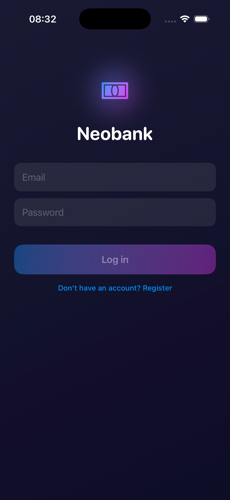
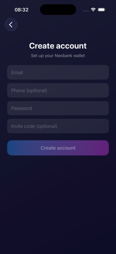
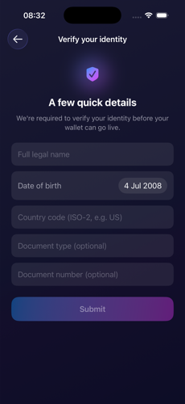
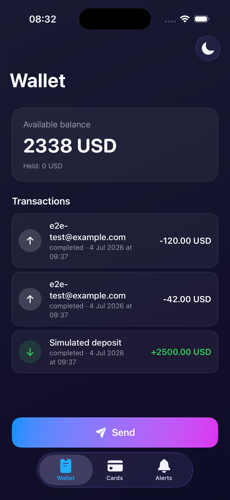
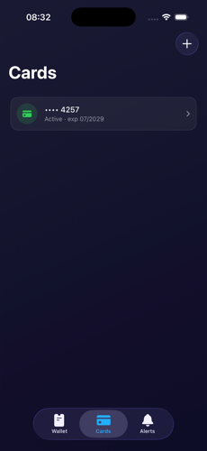
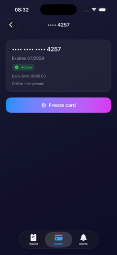
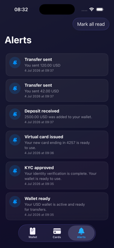
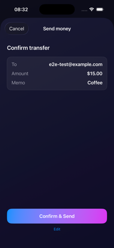
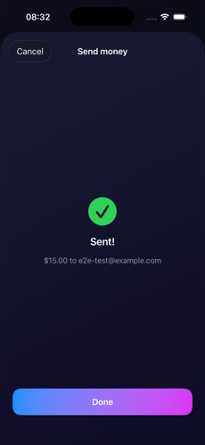
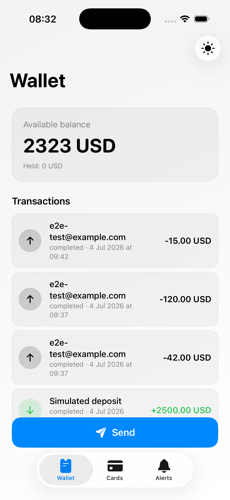

# NeobankNative

A native SwiftUI client for the [neobank](../README.md) gateway BFF — built from scratch
alongside the existing Flutter app ([`../mobile`](../mobile)) against the same API, as a
comparison point for what the two toolkits look like on the same backend.

## Screenshots

<table>
  <tr>
    <td align="center"><br><sub>Login</sub></td>
    <td align="center"><br><sub>Register</sub></td>
    <td align="center"><br><sub>KYC gate</sub></td>
    <td align="center"><br><sub>Wallet</sub></td>
  </tr>
  <tr>
    <td align="center"><br><sub>Cards</sub></td>
    <td align="center"><br><sub>Card detail</sub></td>
    <td align="center"><br><sub>Issue card</sub></td>
    <td align="center"><br><sub>Alerts</sub></td>
  </tr>
  <tr>
    <td align="center"><br><sub>Send money</sub></td>
    <td align="center"><br><sub>Transfer sent</sub></td>
    <td align="center"><br><sub>Light mode</sub></td>
    <td></td>
  </tr>
</table>

## Requirements

- Xcode 16+, iOS 17 deployment target
- [XcodeGen](https://github.com/yonaskolb/XcodeGen) (`brew install xcodegen`) — the
  `.xcodeproj` is generated from [`project.yml`](project.yml), not committed as the
  source of truth
- The gateway running locally at `http://localhost:8080` (see the
  [root README](../README.md#quick-start)); override with the `API_BASE_URL`
  environment variable on the scheme if it's running elsewhere

```sh
xcodegen generate
open NeobankNative.xcodeproj
```

## Architecture decisions

- **State management: `@Observable` (Observation), not `ObservableObject`/`@Published`.**
  Every feature controller (`AuthController`, `WalletHomeController`, `CardsController`,
  ...) is a plain `@MainActor @Observable` class injected via SwiftUI's `.environment(_:)`
  / `@Environment(Type.self)` — no Combine, no `@Published` boilerplate, and views only
  re-render on the properties they actually read.
- **Concurrency: structured, not Combine/timers.** The notification poll loop is a
  `Task` inside `.task(id:)` that sleeps and re-fetches — it cancels automatically when
  the tab disappears or the session changes, with no manual `Timer`/`invalidate()`
  bookkeeping. A 401 mid-request triggers a token refresh through an `actor
  RefreshCoordinator` that coalesces concurrent refresh attempts into one in-flight
  request, so N requests failing at once don't each kick off their own refresh.
- **Networking: one hand-rolled `APIClient`, no generated client.** `Core/Networking/`
  is a small `URLSession`-based client (~150 lines) with two configurations wired up in
  `AppEnvironment`: an unauthenticated one for `/v1/auth/login` and `/v1/auth/register`,
  and an authenticated one that attaches the bearer token and transparently refreshes it
  on 401. JSON is decoded with `keyDecodingStrategy = .convertFromSnakeCase`, matching
  the gateway's field naming directly instead of hand-writing `CodingKeys` per model.
- **Session-scoped cache invalidation via a generation token, not an explicit
  invalidate-list.** Rather than every login/logout explicitly resetting each
  feature controller (the Flutter app's approach), `SessionStore` exposes a
  `generation: UUID` bumped on every transition; feature views key their
  `.task(id: sessionStore.generation)` reload off that. A controller doesn't need to
  know it must be reset — it just always reloads fresh data when the session changes,
  including a logout-then-login-as-someone-else cycle.
- **Design system:** `Core/Design/Theme.swift` — a brand gradient (blue → purple), a
  navy/near-black gradient background in dark mode vs. soft gray-to-white in light,
  glassy low-opacity-fill cards, capsule status pills, and a `PrimaryButtonStyle`/
  `GlowIcon`/`StatusPill` set of small reusable views, applied consistently across every
  screen. A system/light/dark appearance override (`AppAppearance`, `@AppStorage`-backed)
  is exposed from the Wallet tab's toolbar.
- **Folder structure: feature-first**, matching the Flutter app's layout:

  ```
  NeobankNative/Sources/
    Core/              # config, networking (APIClient, APIError), storage (Keychain),
                        # design system, formatting, session/auth plumbing
    Features/
      Auth/            # login, register
      Kyc/             # KYC gate: form, pending, rejection
      Wallet/          # balance, paginated transaction history
      Cards/           # list, issue, detail (freeze/unfreeze)
      Transfers/       # send-money flow (recipient -> amount -> confirm/result)
      Notifications/   # alerts list, mark read / mark all read, background polling
    Root/              # session gate -> KYC gate -> tab shell
  ```

## What's implemented

Auth (login/register, Keychain-backed session, automatic token refresh) → KYC gate →
tabbed Wallet / Cards / Alerts shell, plus a full send-money flow off the Wallet tab.
Feature-for-feature parity with the Flutter app except **card authorizations
(list/detail)** and **transfer history**, left out deliberately as the two remaining
gaps — the Wallet transaction feed and Alerts already surface the same underlying
events (transfers, freezes, deposits), so these would be additive detail views rather
than new capability.

## A deliberate quirk worth knowing about

`POST /v1/transfers` requires a stable `Idempotency-Key` across retries after a network
error, but a fresh one once a submission reaches a definitive server outcome — otherwise
a second "Send" tap after a successful transfer would be replayed as a duplicate of the
first. `TransferSubmitController` only rotates the key after landing in `.result`, not
after `.failed`, mirroring the Flutter app's `TransferSubmitController` exactly.
